# Cub3D

A 3D raycasting engine implementation inspired by the classic Wolfenstein 3D game. This project creates a first-person perspective maze navigation experience using advanced raycasting algorithms and texture mapping.

## Table of Contents

- [Overview](#overview)
- [Features](#features)
- [System Architecture](#system-architecture)
- [Installation](#installation)
- [Usage](#usage)
- [Map Configuration](#map-configuration)
- [Controls](#controls)
- [Project Structure](#project-structure)
- [Build System](#build-system)
- [Technical Details](#technical-details)
- [Testing](#testing)

## Overview

Cub3D is a 3D graphics engine built from scratch using the MiniLibX graphics library. The project demonstrates fundamental computer graphics concepts including raycasting, texture mapping, and real-time rendering. Players can navigate through maze-like environments with textured walls, creating an immersive 3D experience rendered in real-time.

## Features

- **Real-time 3D rendering** using raycasting algorithms
- **Texture mapping** with support for different wall textures based on direction
- **Smooth player movement** with collision detection
- **Mouse and keyboard controls** for navigation
- **Configurable maps** through .cub configuration files
- **Performance optimized** rendering at 60 FPS target
- **Memory safe** implementation with comprehensive cleanup
- **Modular architecture** for easy maintenance and extension

## System Architecture

```mermaid
---
config:
  layout: elk
---
flowchart LR
    %% Entry Point
    START(["./cub3D map.cub"]) --> MAIN["main.c<br>• Argument validation<br>• Game structure setup"]
    
    %% Configuration Phase - Only Memory Operations
    MAIN --> CONFIG_PARSE["Configuration Parser<br>parse_game_config.c<br>• Orchestrates parsing"]
    
    CONFIG_PARSE --> LEXER["Lexer System<br>lexer.c + tokenizer.c<br>• File reading<br>• Token classification<br>• Syntax validation"]
    CONFIG_PARSE --> TEX_PARSER["Texture Config Parser<br>parse_*.c<br>• Read texture paths to memory<br>• Parse RGB values<br>• Store configuration only"]
    CONFIG_PARSE --> MAP_PARSER["Map Config Parser<br>parse_map.c<br>• Read map grid to memory<br>• Basic syntax validation<br>• Store grid configuration"]
    
    %% Validation Phase - Separate Step
    LEXER --> VALIDATION["Map Validation<br>map_validation.c<br>• Flood fill boundary check<br>• Player position validation<br>• Map integrity verification"]
    TEX_PARSER --> VALIDATION
    MAP_PARSER --> VALIDATION
    
    %% Initialization Phase - Actual Resource Loading
    VALIDATION --> GAME_INIT["Game Initialization<br>game.c::init_game<br>• Game state setup<br>• System preparation"]
    
    GAME_INIT --> WINDOW_INIT["Window Setup<br>window.c<br>• MLX initialization<br>• Screen buffer creation"]
    GAME_INIT --> TEX_INIT["Texture Loading<br>texture_loader.c<br>• XPM file reading<br>• Image data conversion<br>• Texture buffer creation"]
    GAME_INIT --> PLAYER_INIT["Player Initialization<br>player.c<br>• Position setup<br>• Direction vectors"]
    
    %% Setup Connections
    WINDOW_INIT --> SETUP_HOOKS["Event Hook Setup<br>events.c<br>• Key handlers<br>• Window events"]
    TEX_INIT --> SETUP_HOOKS
    PLAYER_INIT --> SETUP_HOOKS
    
    %% Main Game Loop - Adaptive Connections
    SETUP_HOOKS --> MLX_LOOP["MLX Main Loop<br>mlx_loop<br>• Event processing<br>• Frame scheduling"]
    
    %% Parallel Event Processing
    MLX_LOOP --> KEY_EVENTS["Keyboard Events<br>events.c<br>• Key press/release<br>• Input state updates"]
    MLX_LOOP --> RENDER_FRAME["Frame Render<br>renderer.c::render_next_frame<br>• Scene composition<br>• Buffer management"]
    
    %% Input Processing Flow
    KEY_EVENTS --> UPDATE_PLAYER["Player Update<br>player_movement.c<br>• Input processing<br>• Position calculation<br>• Collision detection"]
    
    %% Rendering Pipeline - Interconnected
    RENDER_FRAME --> RAYCAST_ALL["Cast All Rays<br>raycast.c::cast_all_rays<br>• Screen column iteration"]
    UPDATE_PLAYER --> RAYCAST_ALL
    
    RAYCAST_ALL --> RAY_INIT["Ray Initialization<br>ray_utils.c<br>• Direction calculation<br>• Screen coordinate mapping"]
    RAY_INIT --> DDA_CALC["DDA Setup<br>raycast.c<br>• Step direction<br>• Side distances<br>• Grid preparation"]
    DDA_CALC --> DDA_PERFORM["DDA Algorithm<br>raycast.c::perform_dda<br>• Grid traversal<br>• Wall detection"]
    
    %% Distance and Texture Calculations
    DDA_PERFORM --> WALL_DIST["Distance Calculation<br>• Perpendicular distance<br>• Fisheye correction"]
    WALL_DIST --> TEX_COORDS["Texture Coordinates<br>texture_utils.c<br>• Wall intersection point<br>• Texture X coordinate"]
    
    %% Drawing Operations
    TEX_COORDS --> DRAW_LINE["Draw Vertical Line<br>draw_utils.c<br>• Wall height calculation<br>• Texture sampling<br>• Pixel drawing"]
    DRAW_LINE --> SCREEN_UPDATE["Screen Buffer Update<br>renderer.c<br>• Pixel manipulation<br>• Buffer composition"]
    
    %% Display and Timing
    SCREEN_UPDATE --> DISPLAY["Display Frame<br>mlx_put_image_to_window<br>• Buffer presentation"]
    DISPLAY --> FPS_LIMIT["Frame Rate Control<br>• 60 FPS targeting<br>• Sleep timing"]
    
    %% Adaptive Loop Connections
    FPS_LIMIT --> RENDER_FRAME
    UPDATE_PLAYER --> RENDER_FRAME
    
    %% Exit Handling
    KEY_EVENTS --> WINDOW_EVENTS["Window Events<br>• Close button<br>• ESC key handling"]
    WINDOW_EVENTS --> EXIT_CHECK{"Exit Signal?"}
    EXIT_CHECK -- Yes --> CLEANUP["Game Cleanup<br>cleanup.c<br>• Texture cleanup<br>• Window cleanup<br>• Memory deallocation"]
    EXIT_CHECK -- No --> MLX_LOOP
    
    CLEANUP --> END(["Program End"])
    
    %% Utility System Connections - Adaptive Support
    subgraph UTILS["Utility Systems - Used Throughout"]
        direction TB
        MEM_MGR["Memory Management<br>cleanup.c<br>• Resource tracking<br>• Safe deallocation"]
        ERROR_SYS["Error Handling<br>error_loggers.c<br>• Error reporting<br>• Graceful failures"]
        DATA_UTILS["Data Structures<br>lines.c + string.c<br>• Dynamic arrays<br>• String operations"]
        MATH_UTILS["Math Utilities<br>direction_utils.c<br>• Vector operations<br>• Trigonometry"]
    end
    
    %% Utility Connections - Non-hierarchical
    CONFIG_PARSE -.-> UTILS
    VALIDATION -.-> UTILS
    GAME_INIT -.-> UTILS
    RENDER_FRAME -.-> UTILS
    UPDATE_PLAYER -.-> UTILS
    RAYCAST_ALL -.-> UTILS
    TEX_INIT -.-> UTILS
    
    %% Resource Dependencies - Adaptive Connections
    TEX_COORDS -.-> TEX_INIT
    DRAW_LINE -.-> TEX_INIT
    UPDATE_PLAYER -.-> VALIDATION
    DDA_PERFORM -.-> VALIDATION
```



## Installation

### Prerequisites

- GCC compiler with C99 support
- Make build system
- X11 development libraries (Linux)
- MiniLibX graphics library

### Build Instructions

```bash
# Clone the repository
git clone [repository-url]
cd Cub3D-main

# Build the project
make

# Build and run with default map
make run

# Build with debug information
make debug

# Clean build artifacts
make clean
make fclean

# Complete rebuild
make re
```

### Dependencies

The project automatically handles MiniLibX linking. Ensure you have X11 development libraries installed:

```bash
# Ubuntu/Debian
sudo apt-get install libx11-dev libxext-dev

# Fedora/CentOS
sudo yum install libX11-devel libXext-devel
```

## Usage

### Basic Usage

```bash
./cub3D [map_file.cub]
```

### Examples

```bash
# Run with basic test map
./cub3D assets/maps/test_basic.cub

# Run with maze configuration
./cub3D assets/maps/test_maze.cub

# Run with large map
./cub3D assets/maps/test_large.cub
```

## Map Configuration

Maps are defined in `.cub` files with the following format:

### Texture Configuration
```
NO assets/textures/north_wall.xpm  # North wall texture
SO assets/textures/south_wall.xpm  # South wall texture
WE assets/textures/west_wall.xpm   # West wall texture
EA assets/textures/east_wall.xpm   # East wall texture
```

### Color Configuration
```
F 220,100,0  # Floor color (RGB)
C 225,30,0   # Ceiling color (RGB)
```

### Map Layout
```
1111111111111111111111111
1000000000110000000000001
1011000001110000000000001
1001000000000000000000001
11111111101100000111000011111111
100000000011000001110111111111111
11110111111111011100000010001
11000000110101011100000010001
10000000000000001100000010001
11000001110101011111011110N0111
11111111 1111111 111111111111
```

### Map Elements
- `1`: Wall
- `0`: Empty space (walkable)
- `N/S/E/W`: Player starting position and orientation
- ` `: Void (outside map boundaries)

## Controls

### Movement
- `W`: Move forward
- `S`: Move backward
- `A`: Move left
- `D`: Move right

### Camera
- `←`: Rotate camera left
- `→`: Rotate camera right

### System
- `ESC`: Exit game

## Project Structure

```
Cub3D-main/
├── src/                    # Source code
│   ├── core/              # Core application logic
│   ├── engine/            # Game engine components
│   ├── graphics/          # Graphics and rendering
│   │   ├── render/        # Rendering subsystem
│   │   ├── raycast/       # Raycasting engine
│   │   └── window/        # Window management
│   ├── io/                # Input/Output operations
│   │   ├── parsing/       # Configuration parsing
│   │   ├── lexer/         # Lexical analysis
│   │   └── events/        # Event handling
│   └── utils/             # Utility functions
├── include/               # Header files
├── assets/                # Game assets
│   ├── maps/             # Map configurations
│   └── textures/         # Wall textures
├── tests/                # Test files
├── config/               # Configuration templates
└── docs/                 # Documentation
```

## Build System

### Available Targets

| Target | Description |
|--------|-------------|
| `make` | Build the project |
| `make clean` | Remove object files |
| `make fclean` | Remove all build artifacts |
| `make re` | Clean rebuild |
| `make run` | Build and run with default map |
| `make test` | Run test scenarios |
| `make norm` | Check code style |
| `make valgrind` | Run with memory leak detection |

### Build Configuration

The Makefile supports different build configurations:
- **Standard build**: Optimized for general use
- **Debug build**: Includes debugging symbols and AddressSanitizer
- **Release build**: Optimized for performance

## Technical Details

### Raycasting Algorithm

The engine uses a DDA (Digital Differential Analyzer) algorithm for efficient ray-wall intersection detection:

1. **Ray Initialization**: Calculate ray direction for each screen column
2. **DDA Setup**: Determine step direction and initial distances
3. **Wall Detection**: Iteratively step through the grid until hitting a wall
4. **Distance Calculation**: Compute perpendicular wall distance to avoid fisheye effect
5. **Texture Mapping**: Map wall textures based on hit position and wall orientation

### Performance Optimizations

- **Efficient memory management** with object pooling
- **Optimized texture sampling** with integer arithmetic
- **Frame rate limiting** to maintain consistent 60 FPS
- **Minimal memory allocations** during render loop
- **Cache-friendly data structures** for better performance

### Graphics Pipeline

1. **Input Processing**: Handle keyboard and mouse events
2. **Player Update**: Update player position and orientation
3. **Raycasting**: Cast rays for each screen column
4. **Wall Rendering**: Draw textured wall segments
5. **Floor/Ceiling**: Fill remaining pixels with solid colors
6. **Buffer Display**: Present the completed frame

## Testing

### Automated Tests

```bash
# Run all test scenarios
make test

# Memory leak detection
make valgrind

# Code style validation
make norm
```

### Test Maps

The project includes various test maps for different scenarios:
- `test_basic.cub`: Simple rectangular map
- `test_maze.cub`: Complex maze layout
- `test_large.cub`: Large-scale environment
- `test_corridor.cub`: Long corridor test
- `test_minimum.cub`: Minimal valid map
